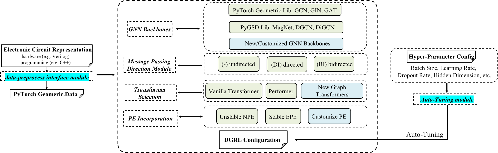

DGRL-Hardware
===========================================================================

Here is the github repository for 'A Benchmark for Directed Graph Representation Learning in Hardware Designs'

For more details, please refer to our `documents <https://benchmark-for-dgrl-in-hardwares.readthedocs.io/en/latest/>`_.

Methods Included:
--------------------

The combinations of 1) GNN backbones/ Graph Transformers, 2) message passing direction, 3) and Magnetic Laplacian Positional Encoding:

- GNN backbones/ Graph Transformers

  `DGCN <https://arxiv.org/abs/2004.13970>`_, `DiGCN <https://proceedings.neurips.cc/paper/2020/hash/cffb6e2288a630c2a787a64ccc67097c-Abstract.html>`_, `MagNet <https://arxiv.org/abs/2102.11391>`_, `GCN <https://arxiv.org/abs/1609.02907>`_, `GIN(E) <https://arxiv.org/abs/1810.00826>`_, `GAT <https://arxiv.org/abs/1710.10903>`_, `GPS-T <https://arxiv.org/abs/2205.12454>`_, `GPS-P <https://arxiv.org/abs/2009.14794>`_.

- Message Passing Direction

  undirected(-) , directed (DI), and bidirected (BI)

- Magnetic Laplacian Positional Encoding

  node PE (NPE), and edge PE (EPE)

Datasets Includes:

- `High-Level Synthesis (HLS) <https://arxiv.org/abs/2201.06848>`_

- `Symbolic Reasoning (SR) <https://arxiv.org/abs/2303.08256>`_

- `Pre-routing Timing Prediction (TIME) <https://dl.acm.org/doi/abs/10.1145/3489517.3530597>`_

- `Computational Graph (CG) <https://dl.acm.org/doi/10.1145/3458864.3467882>`_

- `Operational Amplifiers (AMP) <https://arxiv.org/abs/2308.16406>`_

