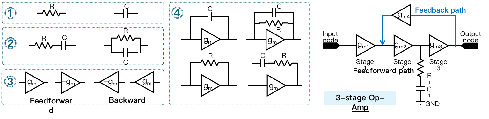

Multi-Stage Amplifiers (AMP)
===============================

Overview
-----------

AMP is originally from `CktGNN: Circuit Graph Neural Network for Electronic Design Automation <https://arxiv.org/abs/2308.16406>`_. 

This dataset focuses on predicting circuit specifications (e.g., DC gain, bandwidth (BW), phase margin (PM)) of 2/3-stage operational amplifiers (Op-Amps), which are simulated by the `circuit simulator Cadence Spectre <https://www.cadence.com/en_US/home/tools/custom-ic-analog-rf-design/circuit-simulation.html>`_.
A 2/3-stage Op-Amp consists of (1) two/three single-stage Op-Amps on the main feedforwoard path and (2) several feedback paths, with one example shown in the right part of Figure.

To make multi-stage Op-Amps more stable, feedforward and feedback paths are used to achieve different compensation schemes, each of which is implemented with a sub-circuit, e.g., single-stage Op-Amps, resistors, and capacitors.
Due to the different topologies of single-stage Op-Amps and various compensation schemes, each sub-circuit is built as a subgraph.

There are 24 potential sub-circuits in the considered 2/3-stage Op-Amps:

- Single R or C ① in Figure, 2 types.

- R and C connected in parallel or serial ② in Figure, 2 types.

- A single-stage Op-Amp (gm) with different polarities (positive, +gm, or negative, -gm) and directions (feedforward or feedback) (③ in Figure, 4 types).

- A single-stage Op-Amp (gm) with R or C connected in parallel or serial (16 types). Note that we use the single-stage Op-Amp with feedforward direction and positive polarities as an example for ④ in Figure.

Interface
-------------

Runner
~~~~~~~~

.. code-block:: python
  
    class AMPRunner():
        def __init__(self, config):
          # init takes a config
        def train_ray(self, tune_parameter_config):
          # function to implement training when tuning with ray
        def train(self):
          # function to implement training when evaluation
        def train_one_epoch(self, data_loader, mode, epoch_idx):
          # function that do back propogation for one epoch
        def test(self, load_statedict = True, test_num_idx = 0):
          # function for testing
        def raytune(self, tune_config, num_samples, num_cpu, num_gpu_per_trial):
          # main function to take the hyper-parameter search space in RAY
        
        

Details are in `./runner/AMP_runner.py <https://github.com/peterwang66/Benchmark_for_DGRL_in_Hardwares/blob/main/DGRL-Hardware/runner/AMP_runner.py>`_.

DataProcessor
~~~~~~~~~~~~~~~

.. code-block:: python
  
    class AMPDataProcessor(InMemoryDataset):
        def __init__(self, config, mode):
          # init takes a config, mode takes from `tune' for tuning, `get_result' for evaluation
        def process(self):
          # key functions to implement AMP data processing
        def read_csv_graph_raw(self, raw_dir, check_repeat_edge):
          # key function to process raw data into PyG data

Details are in `./data_processor/AMP_data_processor.py <https://github.com/peterwang66/Benchmark_for_DGRL_in_Hardwares/blob/main/DGRL-Hardware/data_processor/AMP_data_processor.py>`_.

