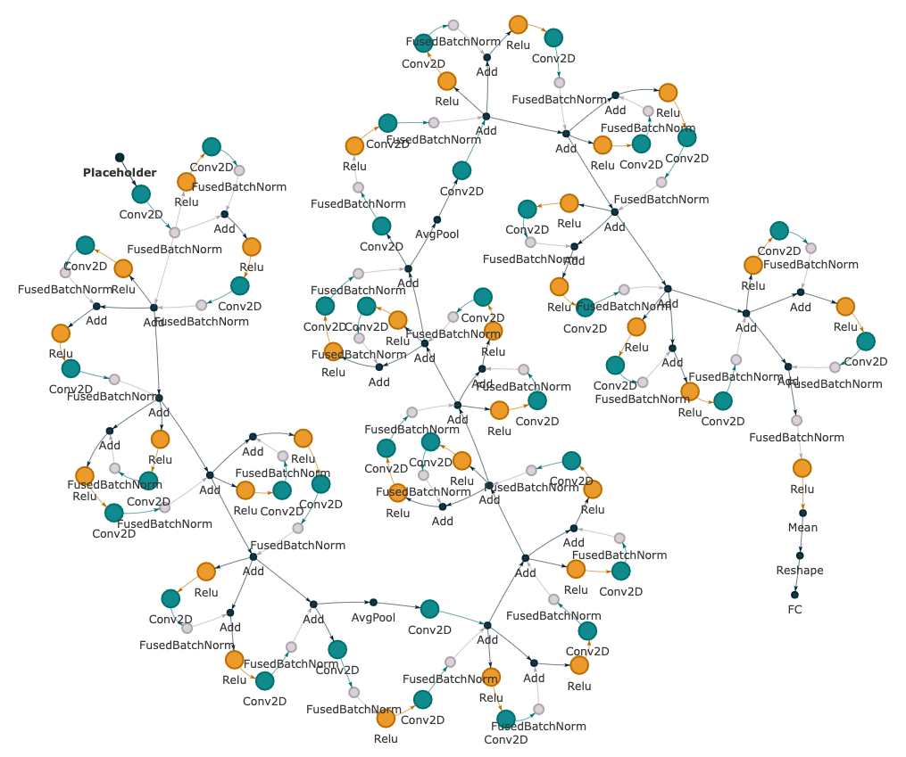

Computational Graph (CG)
============================

Overview
________________________

CG is originally from `nn-Meter: towards accurate latency prediction of deep-learning model inference on diverse edge devices <https://dl.acm.org/doi/10.1145/3458864.3467882>`_. 

This dataset includes 

(1) 12 state-of-the-art CNN models for the ImageNet2012 classification task (i.e., AlexNet, VGG, DenseNet, ResNet, SqueezeNet, GoogleNet, MobileNetv1,  MobileNetv2,  MobileNetv3, ShuffleNetv2, MnasNet, and ProxylessNas), each with 2,000 variants that differ in output channel number and kernel size per layer, and 

(2) 2,000 models from NASBench201 with the highest test accuracy on CIFAR10, each featuring a unique set of edge connections.

In total, this dataset contains 26,000 models with different operators and configurations.
Figure below shows an example of the computational graph of a model in `NASBench201 <https://github.com/D-X-Y/NAS-Bench-201>`_.

Node features include input shape (5 dimensions), kernel/weight shape (padding to 4 dimensions), strides (2 dimensions), and output shape (5 dimensions).
Each computational graph is labeled with the inference latency on three edge devices (i.e., Cortex A76 CPU, Adreno 630 GPU, Adreno 640 GPU).

There is no edge feature in this dataset.

More information can be found in the original paper.

Interface
-------------

Runner
~~~~~~~~

.. code-block:: python
  
    class CGRunner():
        def __init__(self, config):
          # init takes a config
        def train_ray(self, tune_parameter_config):
          # function to implement training when tuning with ray
        def train(self):
          # function to implement training when evaluation
        def train_one_epoch(self, data_loader, mode, epoch_idx):
          # function that do back propogation for one epoch
        def test(self, load_statedict = True, test_num_idx = 0):
          # function for testing
        def raytune(self, tune_config, num_samples, num_cpu, num_gpu_per_trial):
          # main function to take the hyper-parameter search space in RAY
        
        

Details are in `./runner/CG_runner.py <https://github.com/Graph-COM/Benchmark_for_DGRL_in_Hardwares/blob/main/DGRL_Hardware/runner/CG_runner.py>`_.

DataProcessor
~~~~~~~~~~~~~~~

.. code-block:: python
  
    class CGDataProcessor(InMemoryDataset):
        def __init__(self, config, mode):
          # init takes a config, mode takes from `tune' for tuning, `get_result' for evaluation
        def process(self):
          # key functions to implement CG data processing
        def read_csv_graph_raw(self, raw_dir, check_repeat_edge):
          # key function to process raw data into PyG data

Details are in `./data_processor/CG_data_processor.py <https://github.com/Graph-COM/Benchmark_for_DGRL_in_Hardwares/blob/main/DGRL_Hardware/data_processor/CG_data_processor.py>`_.

