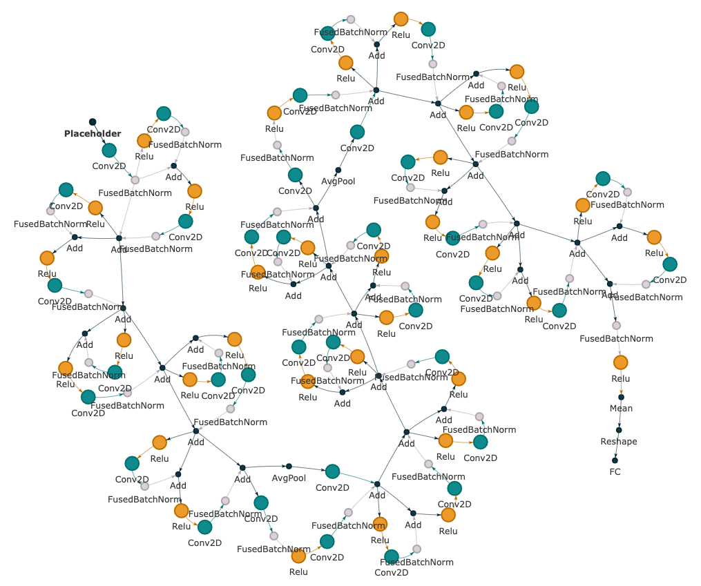

Datasets and Tasks Overview
===========================

The DGRL-Hardware benchmark currently select 5 datasets with 13 tasks in total fronm the hardware design loop, as illustrate in the figure below:

.. image:: fig/line.pdf
   :alt: Selected Datasets and Tasks

High-Level Synthesis (HLS)
________________________

HLS is originally from `High-Level Synthesis Performance Prediction using GNNs: Benchmarking, Modeling, and Advancing <https://arxiv.org/abs/2201.06848>`_, 

After HLS front-end compilation, six node features are extracted.

Each edge has two features, the edge type represented in integers, and a binary value indicating whether this edge is a back edge.
Each graph is labeled based on its post-implementation performance metrics, which are synthesized by Vitis HLS and implemented by Vivado.
Three metrics are used for regression: DSP, LUT, and CP.
The first two are integer numbers indicating the number of resources used in the final implementation; the last one is CP timing in fractional number, determining the maximum working frequency of FPGA.
The DFG and CDFG datasets consists of 19,120 and 18,570 C programs, respectively.
The figure below shows an example C program from the CDFG dataset, with the corresponding control dataflow graph shown in the right.
More information can be found in the original paper.

.. list-table::
   :widths: 50 50
   :header-rows: 0

   * - .. image:: hls/fig/HLS_cdfg.pdf
     - .. image:: hls/fig/hls_example_program.pdf

         

Symbolic Reasoning (SR)
_______________________

SR is originally from `Gamora: Graph Learning based Symbolic Reasoning for Large-Scale Boolean Networks <https://arxiv.org/abs/2303.08256>`_, 

In this dataset, all the circuit designs are represented as and-inverter graphs (AIGs), a concise and uniform representation of BNs consisting of inverters and two-input AND gates, which allows rewriting, simulation, technology mapping, placement, and verification to share the same data structure.
In an AIG, each node has at most two incoming edges; 
a node without incoming edges is a primary input (PI);
primary outputs (POs) are denoted by special output nodes;
each internal node represents a two-input AND function. 
Based on De Morgan’s laws, any combinational BN can be converted into an AIG in a fast and scalable manner.

For each node, there are three node features represented in binary values denoting node types and Boolean functionality.
The first node feature indicates whether this node is a PI/PO or intermediate node (i.e., AND gate).
The second and the third node features indicate whether each input edge is inverted or not, such that AIGs can be represented as homogeneous graphs without additional edge features.

This dataset aims to leverage graph learning based approaches to accelerate the adder tree extraction in (integer) multiplier verification, which involves two reasoning steps:
(1) detecting XOR/MAJ functions to construct adders, and then (2) identifying their boundaries. 
Thus, there are two sets of node labels, i.e., two node-level classification tasks.
One task provides labels specifying whether a node (i.e., a gate) in the AIG belongs to MAJ, XOR, or is shared by both MAJ and XOR.
The other task provides labels specifying whether a node is the root node of an adder.
These AIGs and ground truth labels are generated by the logic synthesis tool ABC.
Figure below shows the AIG of an 8-bit multiplier: the blue and red nodes are the root nodes of XOR functions, with the red nodes directly connecting to the POs; the green nodes are the root nodes of MAJ functions
By pairing one XOR function with one MAJ function sharing the same set of inputs, we can extract the adder tree.
  

.. image:: sr/fig/Multi8_aig.pdf

Pre-routing Timing Prediction (TIME)
_____________________________________

TIME is originally from `A Timing Engine Inspired Graph Neural Network Model for Pre-Routing Slack Prediction <https://guozz.cn/publication/mltimerdac-22/mltimerdac-22.pdf>`_, 

Similar to timing analysis tools, circuits in this dataset are represented as heterogeneous graphs consisting of two types of edges: net edges and cell edges.
The nodes in graphs denote pins in circuits.
The TIME dataset collects 21 real-world benchmark circuits from OpenCores with OpenROAD on SkyWater 130nm technology (i.e. blabla, usb\_cdc\_core, BM64, salsa20, aes128, aes192, aes256, wbqspiflash, cic\_decimator, des, aes\_cipher, picorv32a, zipdiv, genericfir, usb, jpeg\_encoder, usbf\_device, xtea, spm, y\_huff, and synth\_ram).
More information can be found in the original paper.

.. image:: time/fig/time_slack.pdf

Computational Graph (CG)
________________________

CG is originally from `nn-Meter: towards accurate latency prediction of deep-learning model inference on diverse edge devices <https://dl.acm.org/doi/10.1145/3458864.3467882>`_, 

This dataset includes (1) 12 state-of-the-art CNN models for the ImageNet2012 classification task (i.e., AlexNet, VGG, DenseNet, ResNet, SqueezeNet, GoogleNet, MobileNetv1,  MobileNetv2,  MobileNetv3, ShuffleNetv2, MnasNet, and ProxylessNas), each with 2,000 variants that differ in output channel number and kernel size per layer, and (2) 2,000 models from NASBench201 with the highest test accuracy on CIFAR10, each featuring a unique set of edge connections.
In total, this dataset contains 26,000 models with different operators and configurations.
Figure below shows an example of the computational graph of a model in NASBench201.

Node features include input shape (5 dimensions), kernel/weight shape (padding to 4 dimensions), strides (2 dimensions), and output shape (5 dimensions).
Each computational graph is labeled with the inference latency on three edge devices (i.e., Cortex A76 CPU, Adreno 630 GPU, Adreno 640 GPU).
There is no edge feature in this dataset.
More information can be found in the original paper.

Multi-Stage Amplifiers (AMP)
____________________________

AMP is originally from `CktGNN: Circuit Graph Neural Network for Electronic Design Automation <https://arxiv.org/abs/2308.16406>`_, 

This dataset focuses on predicting circuit specifications (e.g., DC gain, bandwidth (BW), phase margin (PM)) of 2/3-stage operational amplifiers (Op-Amps), which are simulated by the circuit simulator Cadence Spectre.
A 2/3-stage Op-Amp consists of (1) two/three single-stage Op-Amps on the main feedforwoard path and (2) several feedback paths, with one example shown in the right part of Figure.

To make multi-stage Op-Amps more stable, feedforward and feedback paths are used to achieve different compensation schemes, each of which is implemented with a sub-circuit, e.g., single-stage Op-Amps, resistors, and capacitors.
Due to the different topologies of single-stage Op-Amps and various compensation schemes, each sub-circuit is built as a subgraph.

.. image:: amp/fig/analog.pdf

