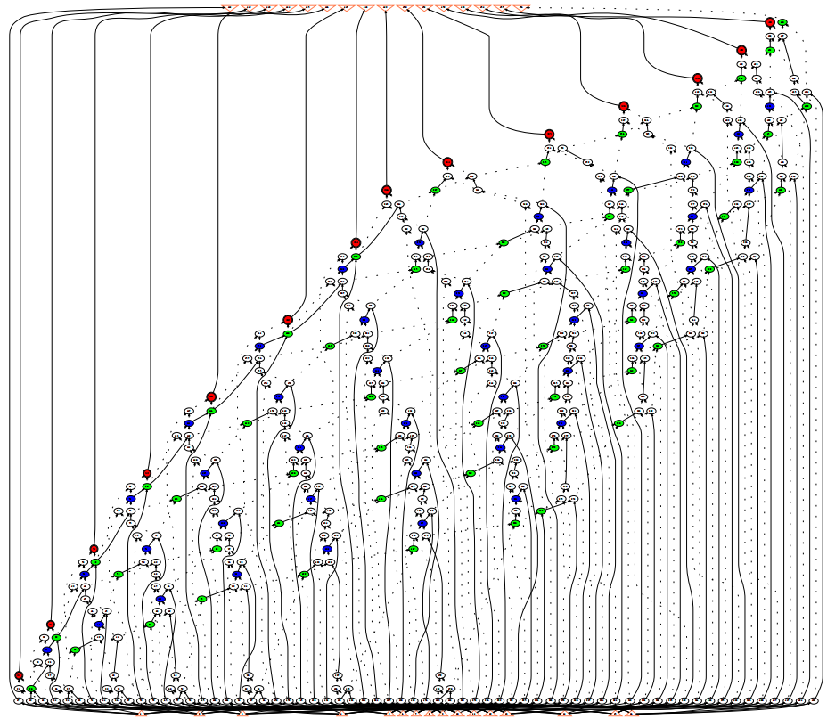

Symbolic Regression (SR)
==========================

Overview
-----------

SR is originally from `Gamora: Graph Learning based Symbolic Reasoning for Large-Scale Boolean Networks <https://arxiv.org/abs/2303.08256>`_.

In this dataset, all the circuit designs are represented as and-inverter graphs (AIGs), a concise and uniform representation of BNs consisting of inverters and two-input AND gates, which allows rewriting, simulation, technology mapping, placement, and verification to share the same data structure.
In an AIG, each node has at most two incoming edges; 
a node without incoming edges is a primary input (PI);
primary outputs (POs) are denoted by special output nodes;
each internal node represents a two-input AND function. 
Based on De Morgan’s laws, any combinational BN can be converted into an AIG in a fast and scalable manner.

For each node, there are three node features represented in binary values denoting node types and Boolean functionality.
The first node feature indicates whether this node is a PI/PO or intermediate node (i.e., AND gate).
The second and the third node features indicate whether each input edge is inverted or not, such that AIGs can be represented as homogeneous graphs without additional edge features.

+------------------------------------------+-------------+
| Node Feature Description                 | Size        |
+==========================================+=============+
| (Net edge) Distances along x/y direction | 2           |
|                                          |             |
| (Cell edge) LUT is valid or no           | 8           |
|                                          |             |
| (Cell) LUT indices                       | 8 * (7+7)   |
|                                          |             |
| (Cell) LUT value matrices                | 8 * (7 * 7) |
+------------------------------------------+-------------+

+---------------------------------------+-----------+
| Edge Feature Description              | Size      |
+=======================================+===========+
| Is primary I/O pin or not             | 1         |
|                                       |           |
| Is fan-in or fan-out                  | 1         |
|                                       |           |
| Distance to the 4 die area boundaries | 4         |
|                                       |           |
| Pin capacitance                       | 4 (EL/RF) |
+---------------------------------------+-----------+

This dataset aims to leverage graph learning based approaches to accelerate the adder tree extraction in (integer) multiplier verification, which involves two reasoning steps:
(1) detecting XOR/MAJ functions to construct adders, and then (2) identifying their boundaries. 
Thus, there are two sets of node labels, i.e., two node-level classification tasks.
One task provides labels specifying whether a node (i.e., a gate) in the AIG belongs to MAJ, XOR, or is shared by both MAJ and XOR.
The other task provides labels specifying whether a node is the root node of an adder.
These AIGs and ground truth labels are generated by the logic synthesis tool `ABC <https://github.com/berkeley-abc/abc>`_.
Figure below shows the AIG of an 8-bit multiplier: the blue and red nodes are the root nodes of XOR functions, with the red nodes directly connecting to the POs; the green nodes are the root nodes of MAJ functions
By pairing one XOR function with one MAJ function sharing the same set of inputs, we can extract the adder tree.
  

Interface
-------------

Runner
~~~~~~~~

.. code-block:: python
  
    class SRRunner():
        def __init__(self, config):
          # init takes a config
        def train_ray(self, tune_parameter_config):
          # function to implement training when tuning with ray
        def train(self):
          # function to implement training when evaluation
        def train_one_epoch(self, data_loader, mode, epoch_idx):
          # function that do back propogation for one epoch
        def test(self, load_statedict = True, test_num_idx = 0):
          # function for testing
        def raytune(self, tune_config, num_samples, num_cpu, num_gpu_per_trial):
          # main function to take the hyper-parameter search space in RAY
        
        

Details are in `./runner/SR_runner.py <https://github.com/peterwang66/Benchmark_for_DGRL_in_Hardwares/blob/main/DGRL-Hardware/runner/SR_runner.py>`_

DataProcessor
~~~~~~~~~~~~~~~

.. code-block:: python
  
    class SRDataProcessor(InMemoryDataset):
        def __init__(self, config, mode):
          # init takes a config, mode takes from `tune' for tuning, `get_result' for evaluation
        def process(self):
          # key functions to implement SR data processing
        def read_csv_graph_raw(self, raw_dir, check_repeat_edge):
          # key function to process raw data into PyG data

Details are in `./data_processor/SR_data_processor.py <https://github.com/peterwang66/Benchmark_for_DGRL_in_Hardwares/blob/main/DGRL-Hardware/data_processor/SR_data_processor.py>`_

