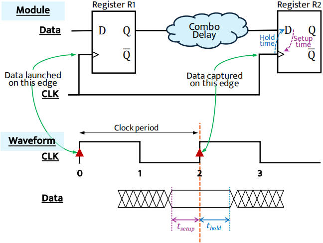

Pre-routing Timing Prediction (TIME)
=======================================

Overview
------------

TIME is originally from `A Timing Engine Inspired Graph Neural Network Model for Pre-Routing Slack Prediction <https://guozz.cn/publication/mltimerdac-22/mltimerdac-22.pdf>`_. 

Similar to timing analysis tools, circuits in this dataset are represented as heterogeneous graphs consisting of two types of edges: net edges and cell edges.
The nodes in graphs denote pins in circuits.
The TIME dataset collects 21 real-world benchmark circuits from `OpenCores <https://opencores.org>`_ with `OpenROAD <https://theopenroadproject.org>`_ on `SkyWater <https://www.skywatertechnology.com/cmos/>`_ 130nm technology (i.e. blabla, usb\_cdc\_core, BM64, salsa20, aes128, aes192, aes256, wbqspiflash, cic\_decimator, des, aes\_cipher, picorv32a, zipdiv, genericfir, usb, jpeg\_encoder, usbf\_device, xtea, spm, y\_huff, and synth\_ram).
More information can be found in the original paper.

Interface
-------------

Runner
~~~~~~~~

.. code-block:: python
  
    class TIMERunner():
        def __init__(self, config):
          # init takes a config
        def train_ray(self, tune_parameter_config):
          # function to implement training when tuning with ray
        def train(self):
          # function to implement training when evaluation
        def train_one_epoch(self, data_loader, mode, epoch_idx):
          # function that do back propogation for one epoch
        def test(self, load_statedict = True, test_num_idx = 0):
          # function for testing
        def raytune(self, tune_config, num_samples, num_cpu, num_gpu_per_trial):
          # main function to take the hyper-parameter search space in RAY
        
        

Details are in `./runner/TIME_runner.py <https://github.com/Graph-COM/Benchmark_for_DGRL_in_Hardwares/blob/main/DGRL_Hardware/runner/TIME_runner.py>`_.

DataProcessor
~~~~~~~~~~~~~~~

.. code-block:: python
  
    class TIMEDataProcessor(InMemoryDataset):
        def __init__(self, config, mode):
          # init takes a config, mode takes from `tune' for tuning, `get_result' for evaluation
        def process(self):
          # key functions to implement TIME data processing
        def read_csv_graph_raw(self, raw_dir, check_repeat_edge):
          # key function to process raw data into PyG data

Details are in `./data_processor/TIME_data_processor.py <https://github.com/Graph-COM/Benchmark_for_DGRL_in_Hardwares/blob/main/DGRL_Hardware/data_processor/TIME_data_processor.py>`_.
