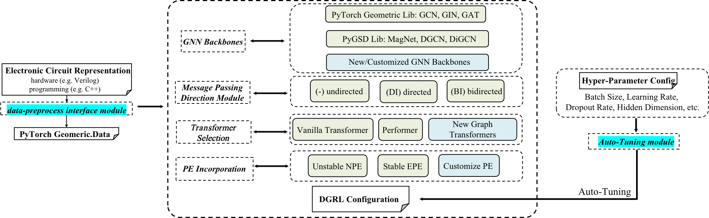
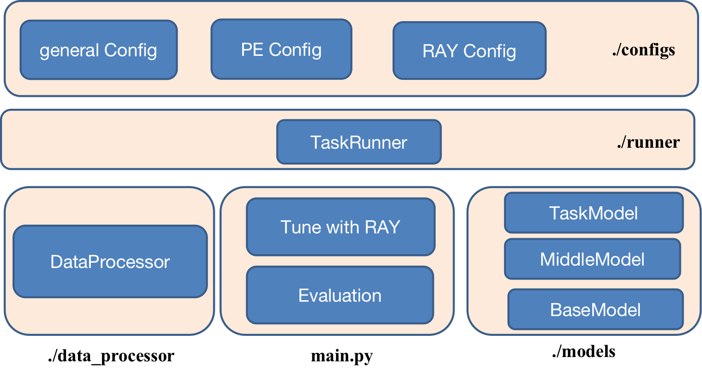
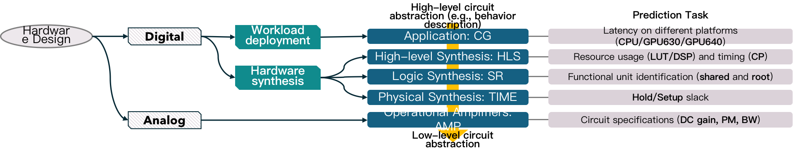

Welcome to DGRL-Hardware's documentation!
===================================

DGRL-Hardware is a toolbox for benchmarking **directed graph representation learning (DGRL)** methods. The DGRL methods can serve as surrogate models to give fast and cheap predictions for labels on directed graphs. The toolbox takes hardware design problems as examples, where hardware circuits can be formulated as directed graphs, and traditional simulations to access the properties of hardwares may take considerable time (hours or days). Specifically, the toolbox consists with 5 hardware designing datasets for evaluation, and users may also customize new datasets for DGRL evaluation, not limited to hardware designing tasks. 

The toolbox involves DGRL method selection/customization, which implements 21 methods covering state-of-the-art methods for directed graphs including spectral methods, spatial methods and graph transformers, and provides the interface to design new methods.

The toolbox also offers hyper-parameter auto-tuning and evaluation pipelines. 

DGRL-hardware is built based on `Pytorch 2.0 <https://pytorch.org/get-started/pytorch-2.0/>`_, `PyTorch Geometric <https://pytorch-geometric.readthedocs.io>`_, `PyTorch Geometric Signed and Directed <https://pytorch-geometric-signed-directed.readthedocs.io>`_, `RAY Tune <https://docs.ray.io/en/latest/tune/index.html>`_ .

.. note::

   This project is under active development.

Get Started
==============

DGRL-hardware is built and controlled by three configurations, namely the general config which defines the method, the PE config which determins the use of PE, and the RAY config which provides hyper-parameter search space. With the configuration, one could call a task runner for hyper-parameter tuning or evaluation. Three components are connected with the task runner, namely the dataset processor, the tuning/evaluation pipeline and the model.

To get started, one may first set-up the environment, then one may config DGRL methods (select an existing method or design a novel method) and config datasets (select an existing dataset or introduce a new dataset). After the DGRL method is configured, one may run RAY-tune for hyper-parameter tuning and then conduct performance evaluation.
   
`Environment Requirement <environment/environment.html>`_\
-------------------------------------------------------------
      
In this section, we introduce the basic environment requirement to tun the toolbox.

Config a method
------------------

In this section, we introduce how to config a DGRL method in the toolbox. One may directly select from an existing method or customize a novel method.

- `Select from existing methods <DGRL/method_select.html>`_

- `Customize new backbone/PE/message passing methods <DGRL/method_customize.html>`_

Config a dataset
---------------------

In this section, we introduce how to config a dataset. One may select form the existing dataset or customize a novel dataset.

- `Select from existing datasets <data/data_select.html>`_

- `Customize new datasets <data/data_customize.html>`_

`Tune with RAY <intro_tune.html>`_
--------------------------------------

In this section, we show the interface on how to do hyper-parameter with the help of RAY, and how to config the search space.

`Evaluation on Existing Datasets <intro_evaluation.html>`_
----------------------------------------------------------------

In this section, we introduce how to evaluate configured method on configured datasets.

   

Introduction and Interface of Existing Datasets
====================================

`High-Level Synthesis (HLS) <data/hls.html>`_
---------------------------------------------------

`Symbolic Reasoning (SR) <data/sr.html>`_
-----------------------------------------------------

`Pre-Routing Time Prediction (TIME) <data/time.html>`_
----------------------------------------------------------

`Computational Graph (CG) <data/cg.html>`_
-----------------------------------------------

`Operational Amplifiers (AMP) <data/amp.html>`_
----------------------------------------------------

Introduction and Interface of Included DGRL Methods
=======================================

   - `Configuration file to config existing methods <DGRL/configuration.html>`_

   - `Base Models: GNN backbones or Graph Transformers <DGRL/base_model.html>`_

Introduction and Interface of Positional Encoding (PE)
---------------------------------------------------------

   - `Obtain Magnetic Laplician PE for Digraphs <DGRL/PE_obtain.html>`_

   - `Incorporate Magnetic Laplician PE for Digraphs <DGRL/PE_usage.html>`_

   

