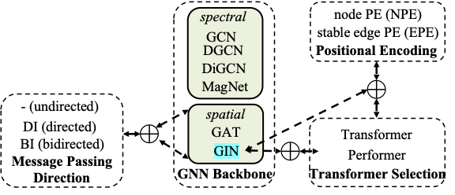

Welcome to DGRL-Hardware's documentation!
===================================

.. image:: fig/toolbox.png

DGRL-Hardware is a toolbox for benchmarking **directed graph representation learning (DGRL)** methods. Directed graph representation learning (DGRL) can be applied in various fields, such as enhancing social network analysis, improving recommendation systems by capturing the directional interactions between users and items, and assessing the properties of hardware designs via their directed graph representations (e.g. circuit netlists, control and data flow graphs or computational graphs). DGRL-Hardware toolbox provides the implementation of spectral GNNs, spatial GNNs, graph transformers (GT) combined with advanced DGRL techniques (e.g. message passing direction and positional encoding), and takes the hardware design problems as examples to evaluate DGRL methods. It consists of five datasets along with 13 tasks from the hardware design loop for evaluation, and users may also introduce new directed graph datasets for DGRL evaluation/selection or create new methods to evaluate on the selected datasets. The toolbox also offers hyper-parameter auto-tuning and evaluation pipelines. 

DGRL-hardware is built based on `Pytorch 2.0 <https://pytorch.org/get-started/pytorch-2.0/>`_, `PyTorch Geometric <https://pytorch-geometric.readthedocs.io>`_, `PyTorch Geometric Signed and Directed <https://pytorch-geometric-signed-directed.readthedocs.io>`_, `RAY Tune <https://docs.ray.io/en/latest/tune/index.html>`_ .

.. note::

   This project is under active development.

Get Started
-------------

.. image:: fig/code_frame.png

DGRL-Hardware is built and controlled by three configurations, user could configure a DGRL method with the **general config**, which defines the GNN backbone or the graph transformer to use along with MPNN layer message passing direction and their hyper-parameters. The toolbox also provides the implementation of two kinds of positional encodings (PE) which could flexibly combine with the backbones and further improve the model expressiveness, users could configure the incorporation of positional encodings in the **PE config**. The third config is **RAY config**, which defines the hyper-parameter search space when conducting auto hyper-parameter tuning on the models. With the configuration, one could call a TaskRunner (as shown in the middle layer of the figure) for either hyper-parameter tuning or model evaluation. Three key components in the toolbox are connected with the TaskRunner, namely the dataset processor, the tuning/evaluation pipeline and the model implementation.

To get started, one may first set-up the environment, then configure DGRL methods (select an existing method or design a novel method) and config datasets (select an existing dataset or introduce a new dataset). After the DGRL method is configured, one may run RAY-tune for hyper-parameter tuning and then conduct performance evaluation.

   
1. `Environment Requirement <environment/environment.html>`_
~~~~~~~~~~~~~~~~~~~~~~~~~~~~~~~~~~~~~~~~~~~~~~~~~~~~~~~~~~~~~~~~~
      
In this section, we introduce the basic environment requirement to run the toolbox.

2. Config a method
~~~~~~~~~~~~~~~~~~~~~

In this section, we introduce how to config a DGRL method in the toolbox. One may directly select from an existing method or customize a novel method.

- `Select from existing methods <DGRL/method_select.html>`_

- `Customize new backbone/PE/message passing methods <DGRL/method_customize.html>`_

3. Config a dataset
~~~~~~~~~~~~~~~~~~~~~~

In this section, we introduce how to config a dataset. One may select form the existing dataset or customize a novel dataset.

- `Select from existing datasets <data/data_select.html>`_

- `Customize new datasets <data/data_customize.html>`_

4. `Tune with RAY <intro_tune.html>`_
~~~~~~~~~~~~~~~~~~~~~~~~~~~~~~~~~~~~~~~~~~~

In this section, we show the interface on how to do hyper-parameter with the help of RAY, and how to config the search space.

5. `Evaluation on Existing Datasets <intro_evaluation.html>`_
~~~~~~~~~~~~~~~~~~~~~~~~~~~~~~~~~~~~~~~~~~~~~~~~~~~~~~~~~~~~~~~~

In this section, we introduce how to evaluate configured method on configured datasets.

   
Toolbox Reference
====================

Covered Datasets
-------------------------------------------------

- `High-Level Synthesis (HLS) <data/hls.html>`_

- `Symbolic Reasoning (SR) <data/sr.html>`_

- `Pre-Routing Time Prediction (TIME) <data/time.html>`_

- `Computational Graph (CG) <data/cg.html>`_

- `Operational Amplifiers (AMP) <data/amp.html>`_

DGRL Methods
--------------------------------------------

- `Base Models: GNN Backbones, Graph Transformers and MPNN Layer Direction <DGRL/base_model.html>`_

- Positional Encoding (PE) 

   - `Positional Encodings, an Overview <intro_pe.html>`_

   - `Obtain Magnetic Laplician PE for Directed Graphs <DGRL/PE_obtain.html>`_

   - `Incorporate Magnetic Laplician PE for Directed Graphs <DGRL/PE_usage.html>`_

   

