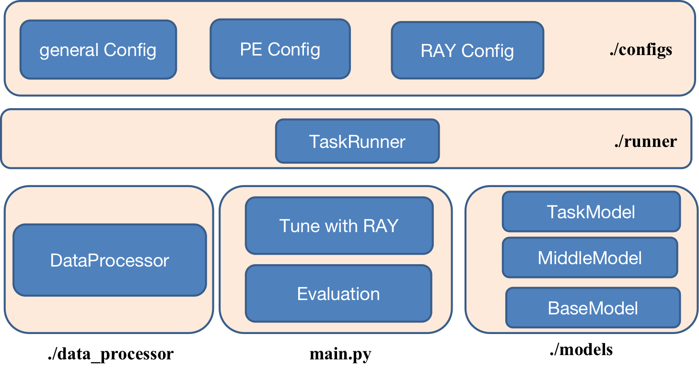

Model Evaluation with Existing Methods
========================================

After configuring a DGRL method and specify a dataset, one could perform evaluation by training and testing with different seeds, an example command to evaluate could be:

.. code-block:: sh
    
    nohup python -u main.py --mode get_result --general_config amp/gain/bigine_lap \
    --pe_config lap10/lap_spe --device 1 \
    >./amp_gain_bigin_lap_spe_final_results_origin.log 2>&1 </dev/null &

The scripts to tune the methods from our benchmark is provided in `./main.sh <https://github.com/Graph-COM/Benchmark_for_DGRL_in_Hardwares/blob/main/DGRL_Hardware/main.sh>`_.

